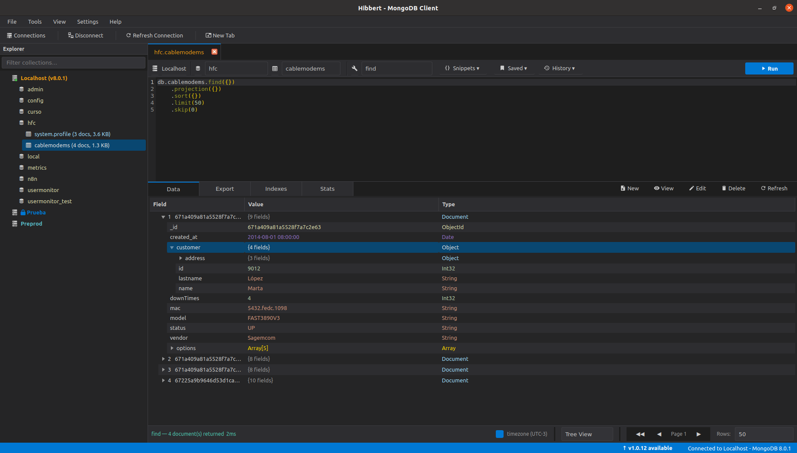

# Hibbert - MongoDB Client

A lightweight desktop MongoDB GUI client built with Python and Qt6. Runs on Linux, macOS and Windows.



## Features

- Connection manager with multiple saved connections
- Database & collection tree browser
- JSON query editor with syntax highlighting
- Results viewer (Table & JSON views)
- Multiple query tabs per connection
- Index management
- Slow query profiler
- Server logs viewer
- Dump & restore databases
- Read-only mode per connection
- Customizable themes
- CLI for scripting and automation (`hibbert-cli`)
- MCP server for AI assistant integration (`hibbert-mcp`)

---

## Requirements

- Python 3.10+
- MongoDB 4.0+
- Icons provided by [qtawesome](https://github.com/spyder-ide/qtawesome) (Material Design Icons)
- [mcp](https://github.com/modelcontextprotocol/python-sdk) (optional, required for MCP server only)

---

## Installation

> 📦 **[Download the latest release](https://github.com/d4m111/hibbert_through_the_frame/releases/latest)**

### Linux — Debian-based (Ubuntu, Debian, Mint...)

```bash
sudo dpkg -i hibbert_*_linux-debian_amd64.deb
```

### Linux — RPM-based (Fedora, RHEL, openSUSE...)

```bash
sudo rpm -i hibbert_*_linux-rpm_x86_64.rpm
```

### Linux — Universal (Arch, any distro)

```bash
chmod +x hibbert-*.AppImage
./hibbert-*.AppImage
```

### Windows 10 / 11

Run `hibbert-*-setup.exe` and follow the installer wizard.

### macOS

Open `hibbert-*.dmg`, drag **Hibbert** to the Applications folder.

---

## CLI

Hibbert also provides a command-line interface for scripting and automation.

```bash
# List saved connections
python -m hibbert.cli connections

# List databases
python -m hibbert.cli databases -c "Local"

# List collections
python -m hibbert.cli collections -c "Local" -d mydb

# Run a query
python -m hibbert.cli query -c "Local" -d mydb --collection users \
  --filter '{"active": true}' --limit 10

# List indexes
python -m hibbert.cli indexes -c "Local" -d mydb --collection users

# Collection stats
python -m hibbert.cli stats -c "Local" -d mydb --collection users
```

Supported operations for `query --operation`: `find`, `aggregate`, `count`, `distinct`, `insertOne`, `insertMany`, `updateOne`, `updateMany`, `deleteOne`, `deleteMany`, `findOneAndUpdate`, `findOneAndReplace`, `findOneAndDelete`.

---

## MCP Server

Hibbert includes an MCP server so AI assistants (Claude Code, Claude Desktop, Cursor, etc.) can query MongoDB directly.

### Setup

Add to your `.mcp.json`:

```json
{
  "mcpServers": {
    "hibbert": {
      "command": "/path/to/venv/bin/python",
      "args": ["-m", "hibbert.mcp_server"],
      "cwd": "/path/to/hibbert"
    }
  }
}
```

By default, the MCP server runs in **read-only mode**. Write and delete operations are blocked unless you explicitly opt in ("HIBBERT_ALLOW_WRITES": "true"):

```json
{
  "mcpServers": {
    "hibbert": {
      "command": "/path/to/venv/bin/python",
      "args": ["-m", "hibbert.mcp_server"],
      "cwd": "/path/to/hibbert",
      "env": { "HIBBERT_ALLOW_WRITES": "true" }
    }
  }
}
```

> ## MCP Server — Important Warning
> 
> The Hibbert MCP server grants AI assistants **direct read and write access** to your MongoDB databases, including the ability to **insert, update, and delete documents**.
> 
> **Use with caution:**
> 
> - AI assistants can execute destructive operations (`deleteOne`, `deleteMany`, `findOneAndDelete`, `updateMany`, etc.) without additional confirmation.
> - You are solely responsible for any data loss or unintended modifications caused by commands issued through the MCP server.
> - Hibbert and its contributors are **not liable** for any data loss, corruption, or unintended changes resulting from the use of the MCP server.
> 
> By configuring and using the Hibbert MCP server, you acknowledge and accept these risks.

### Available tools

| Tool | Description |
|---|---|
| `list_connections` | List saved connections |
| `connect` | Connect to a saved connection by name |
| `list_databases` | List databases |
| `list_collections` | List collections in a database |
| `query` | Run find, aggregate, count, update, delete, etc. |
| `get_indexes` | List indexes for a collection |
| `collection_stats` | Get collection statistics |

---

## License

This project is licensed under the GNU General Public License v3.0. See the [LICENSE](LICENSE) file for details.

For commercial use, contact d4m111@gmail.com
